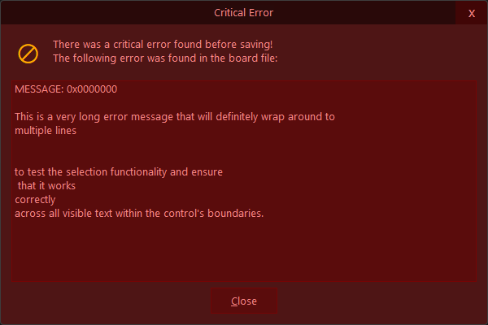
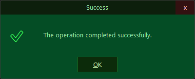
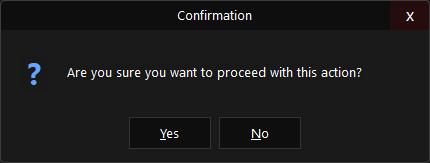
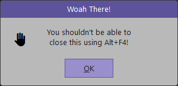

# Custom Dialogs for AHK2
__customDialog - *v1.8*__

**Example images below!**

**Example images not showcasing full functionality! (mainly inputs and progress bars)**


- Creates a highly customizable dialog box.
- This function allows for extensive control over appearance, layout, and behavior,
- A versatile replacement for standard message boxes.
- Returns an object containing the user's choice and the GUI object itself.

## Features / Configurable Properties

- Colours / Theming
- Window & Layout
  - Width / Height
  - Rounded Corners (Win11 specific enhancements)
  - Message text alignment (centering, and top margin)
- Content & Text
  - Title & Message
  - Icon (Emoji line font, and set colour)
  - "Detail" _(disabled)_ textbox (control over rows shown)
  - Titlebar height, Exit button (exit button colours)
- Input (text input)
- Progress bar(s) (upto 2) with status text (don't use with modal)
- Buttons (how many, and text)
- "Advanced" features:
  - Modal - ie prevent parent stealing focus back
  - Sound (triggers default windows dialog sounds) (alt option available)
  - Auto/set/disable parent to owner window
  - Toggle AlwaysOnTop
  - Disable waitForResponse (returns the dialog gui instance, allowing advanced mods)
  - Disable Alt F4
  - Wrapper provided for working with a Map instead of a raw object (example script targeting working with webview2 (ie calling customDialog from JS))

---

## Limitations / Future updates:

- Limited keyboard controls: enter and escape, but no active button highlight (arrow keys) 
- "Fake" border around detail is drawn over top of detail control, future update will fix (just draw 4 1px lines lol)
- ~~Would be nice to have hover colour change on buttons (and exit button)~~ (Done)
- ~~Add "forceFocus", which will toggle sound and refocus to dialog if the parent dialog ever is refocused whilst dialog still active~~ (Done (modal))
- ~~Missing a input text mode, but this would necessitate probably using a gui lib (buttons could be buttons lol (currently just text controls))}~~ (Done)
- Blue highlight on text
- Auto timeout feature (idk how I forgot this one, my bad g)
- An even more configurable webview2 popup lib, but that would a different project all together. (customDialog would still be useful in like... Event of a crash and providing a crash report (think adobe crash dialog)) 
- ~~Some of the properties are missing from the intellesense text comment block, generally could be improvied a touch, need to learn more about it~~

---


## Basic Usage

```ahk
customDialog({
    title: "Success",
    message: "The operation completed successfully."
})
```

## Preset Example

```ahk
successPreset := {
    icon: "✅",
    width: 400,
    messageTop: 9,
    background: "044d25",
    backgroundAlt: "0c2b0a",
    titlebarBG: "0d1f0c",
    fontColor: "9ceeab",
    iconColor: "37ff58",
    detailBorder: "1f681a",
    buttonColor: "d2ffb4",
    exitColor: "ffabab",
    exitBG: "331111",
    align: "Center"
}
customDialog({
    title: "Success",
    message: "The operation completed successfully."
}, successPreset)
```


## Example Images:






